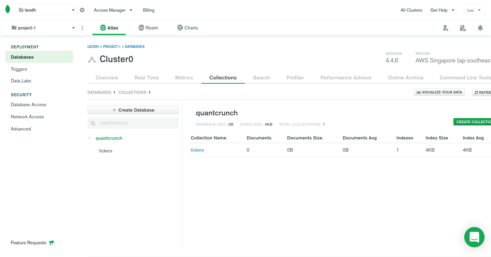
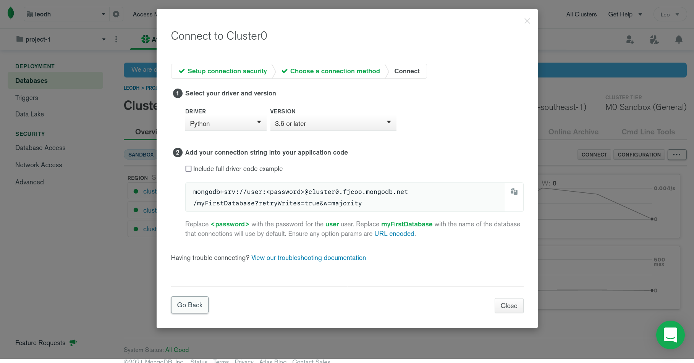

# Python Backend Documentation

# System Architecture

The following diagram shows how each of the individual sub-systems interact
with one another. The following sections would focus on the setup process
of the following subsystems:

- Cloud Database
- API Server


# Setup

## Cloud Database

The database will be used to store the recommendations generated by the
algorithm and also act as a form of persistent storage to store the trade
simulations.

To create a cloud database, first you can visit the
[MongoDB Cloud](https://www.mongodb.com/cloud) to register an account. After
you have registered an account, you can follow the following steps to setup the
database.

1. When you are at the projects dashboard, click on the `new project` button to
   create a project.

   

2. Name your project with a recognisable name and proceed.

   

3. Click on `create project`.

   

4. Once the project has been created, you can proceed to click on `build database`.

   

5. The free option would suffice of development. You might want to change the
   cloud provider and region if you want. Otherwise, you can proceed to click
   on `create cluster`.

   

6. Once the cluster has been created, click on `connect`.

   

7. Click on the `Collections` tab and then on `Add My Own Data`.

   

8. There will be modal which prompts you to provide the database name and
   collection name. Set the database name to `quantcrunch` and the collection
   name to `tickers`.

   

9. Once the database and collection has been created, click on `create collection` and add the following collections: `performance`,
   `recommendations` and `open_positions`.

   

10. The end result should look as such.

    

11. Click on the `tickers` collection and insert the following documents as
    shown in the image.

    ```json
    [
      {
        "symbol": "AAPL",
        "exchange": "NASDAQ",
        "name": "Apple Inc."
      },
      {
        "symbol": "AMZN",
        "exchange": "NASDAQ",
        "name": "Amazon.com Inc."
      },
      {
        "symbol": "BABA",
        "exchange": "NYSE",
        "name": "Alibaba Group Holdings Limited"
      },
      {
        "symbol": "GOOG",
        "exchange": "NASDAQ",
        "name": "Alphabet Inc."
      },
      {
        "symbol": "SHOP",
        "exchange": "NYSE",
        "name": "Shopify Inc."
      },
      {
        "symbol": "BX",
        "exchange": "NYSE",
        "name": "Blackstone Group Inc."
      },
      {
        "symbol": "C",
        "exchange": "NYSE",
        "name": "Citigroup Inc."
      },
      {
        "symbol": "TLT",
        "exchange": "NASDAQ",
        "name": "iShares 20 Plus Year Treasury Bond ETF"
      },
      {
        "symbol": "NVDA",
        "exchange": "NASDAQ",
        "name": "NVIDIA Corporation"
      },
      {
        "symbol": "BLK",
        "exchange": "NYSE",
        "name": "BlackRock Inc."
      },
      {
        "symbol": "NOK",
        "exchange": "NYSE",
        "name": "Nokia Corporation"
      }
    ]
    ```

    

12. After all the documents have been inserted, go to the `overview` tab and
    click on `connect`. There will be a modal which prompts you to add a
    connection IP address and database user. For the connection IP address,
    you might want to choose `allow access from anywhere` when in development.
    Create a user and record the credentials used. After both steps have been
    done, proceed by clicking on `choose a connection method` and
    then `connect your application`.

    

13. Set the dropdowns to the values shown in the image and take note of the
    connection string. The connection string will be used in the setup process
    for the API server. This would be the end for the setup process for the cloud
    database.

    

## API Server

To setup the API server, ensure that you have `docker` as well as
`docker-compose` installed. You can refer to the following guides provided by
docker if you have yet to install them on your machine.

- [docker installation guide](https://docs.docker.com/engine/install/)
- [docker-compose installation guide](https://docs.docker.com/compose/install/)

If you are on Windows/MacOS, you can opt to download `Docker Desktop` instead
as it contains all of the required binaries.

- [Docker Desktop installation guide](https://docs.docker.com/desktop/)

Once you have everything setup, you can then proceed to clone the following
repository into your machine using the command below. This assumes that you
have `git` installed. If you do not have it installed, you can visit the
following
[link](https://git-scm.com/book/en/v2/Getting-Started-Installing-Git).

```sh
$ git clone https://github.com/loocurse/quant-crunch.git
```

Once you have successfully cloned the repository on to your local machine,
navigate into the directory `qc-backend-server` as such.

```sh
$ cd quant-crunch/qc-backend-server
```

Proceed to create a `.env` file in the directory with the your configurations.
The variables to be set are as such.

| Name            | Description                                                                              |
| :-------------- | :--------------------------------------------------------------------------------------- |
| MONGO_ATLAS_URI | The connection string for the MongoDB database.                                          |
| POLYGON_API_KEY | API key from Polygon&#46;io with the [stocks developer](https://polygon.io/pricing) tier |
| PORT            | Desired port number for the server to listen to. (Optional) Default is set to `5050`.    |

The contents of the `.env` file should look like the following:

```
MONGO_ATLAS_URI=mongodb+srv://....
POLYGON_API_KEY=ABCDEF...
```

Once you have setup the required files, you can use the following command
to run server.

```sh
$ docker-compose up -d
```

The server would be running on `http://localhost:5050` or whichever port number
that you have specified.

To access the interactive API document (provided by
Swagger UI), you can visit `http://localhost:5050/docs`.

## Heroku Deployment

To migrate from docker and deploy the project on heroku, you need to create the
following file in the `quant-crunch` directory. This assumes that you have
already setup the MongoDB instance from earlier.

```yaml
# heroku.yml
build:
  docker:
    web: qc-backend-server/Dockerfile
```

Before you push the files onto heroku, you have to add the redis add-on to your
project. A `Hobby Dev` plan would suffice. You are also required to set the
`config vars` similar to the `.env` file for docker. The following variables
are required: `MONGO_ATLAS_URI` and `POLYGON_API_KEY`. Please refer to the above
documentation for the description of the variables.

Once you have created the file `heroku.yml`, you can use the following
command to push the files to your heroku project. This assumes you have `Heroku CLI` installed, if you do not, you can visit the following
[link](https://devcenter.heroku.com/articles/heroku-command-line).

```sh
$ heroku git:remote -a project-name-here
$ git push heroku main
$ heroku ps:scale web=1 -a project-name-here
```

> **_NOTE:_**
>
> Once everything is up and running, you might want to change the dyno type used
> for the server. There's no issue with a free dyno but you have to ensure that
> the server is not asleep from the pre-market hours to post-market hours (4AM -
> 8PM ET) or it would not record any trades. As dynos sleep if they receive no
> web traffic in a 30-minute period, you would have to find a way to keep the
> server alive for the duration.
>
> A common way would to use a pinging service like
> [Kaffeine](https://kaffeine.herokuapp.com/). Otherwise, you can avoid the
> hassle by upgrading a `Hobby` tiered dyno which will ensure that the dyno runs
> all the time.

# API Documentation

The following are the endpoints that can be accessed.

## `GET` `/api/tickerlist`

### Description

---

Retrieves a list of the valid tickers that the algorithm tracks along with
their respective price change in the last 24 hours.

### Parameters

---

No parameters.

### Response

---

```json
{
  "tickerlist": [
    {
      "name": "string",
      "exchange": "string",
      "symbol": "string",
      "change": 0,
      "change_perc": 0
    }
  ]
}
```

**`Response Attributes`**

| Attribute   | Description                                                                           |
| :---------- | :------------------------------------------------------------------------------------ |
| name        | Full name of the ticker.                                                              |
| exchange    | Stock exchange symbol for the ticker.                                                 |
| symbol      | Symbol of the ticker.                                                                 |
| change      | Absolute price change in the last 24 hours. Will be set to 0 if market is not open.   |
| change_perc | Price change percentage in the last 24 hours. Will be set to 0 if market is not open. |

## `GET` `/api/recommendations`

### Description

---

Retrieves a list of the most recent recommendations generated by the algorithm.

### Parameters

---

**limit** (optional)

A limit on the the number of recommendations to return.
Default value is set to `50`.

### Response

---

```json
{
  "results": [
    {
      "symbol": "string",
      "target_price": 0,
      "entry_price": 0,
      "open_timestamp": 0,
      "stop_loss": 0,
      "expected_profit": 0
    }
  ]
}
```

**`Response Attributes`**

| Attribute       | Description                                                                        |
| :-------------- | :--------------------------------------------------------------------------------- |
| symbol          | Symbol of the ticker.                                                              |
| target_price    | Target price (USD) for which the user should sell the stock to gain profits.       |
| entry_price     | Current price (USD) when the recommendation is generated.                          |
| open_timestamp  | UNIX timestamp when the recommendation is generated.                               |
| stop_loss       | Stop loss price (USD) for which the user should sell the stock to minimize losses. |
| expected_profit | Expected profit in percentage if the user sells at the target price.               |

## `GET` `/api/performance`

### Description

---

Retrieves all the trades executed by the algorithm, categorised into
months.

### Parameters

---

No parameters.

### Response

---

```json
{
  "performance": [
    {
      "month": 0,
      "realized_pnl": 0,
      "positions": [
        {
          "symbol": "string",
          "target_price": 0,
          "entry_price": 0,
          "open_timestamp": 0,
          "stop_loss": 0,
          "pnl": 0,
          "notes": "string",
          "close_timestamp": 0
        }
      ]
    }
  ]
}
```

**`Response Attributes`**

| Attribute    | Description                                              |
| :----------- | :------------------------------------------------------- |
| month        | UNIX timestamp for the particular month.                 |
| realized_pnl | Cummulative profit and loss for the month in percentage. |
| positions    | Array of all the positions closed in the month.          |

**`Response.positions Attributes`**

| Attribute       | Description                                                                                                                     |
| :-------------- | :------------------------------------------------------------------------------------------------------------------------------ |
| symbol          | Symbol of the ticker.                                                                                                           |
| target_price    | Target price (USD) for which the user should sell the stock to gain profits.                                                    |
| entry_price     | Current price (USD) when the recommendation is generated.                                                                       |
| open_timestamp  | UNIX timestamp when the recommendation is generated.                                                                            |
| stop_loss       | Stop loss price (USD) for which the user should sell the stock to minimize losses.                                              |
| pnl             | Profit and loss in percentage for the particular trade.                                                                         |
| notes           | Indicates either the target price or stop loss price has been reached.<br> Values: `Reached target price`, `Reached stop loss`. |
| close_timestamp | UNIX timestamp when the position is closed.                                                                                     |

# Behind the Scenes (API Server)

## Main Application

The main application is an ASGI server that serves RESTful requests. The chosen
framework used to implement the API server is FastAPI, which is built on top of
Starlette.

## Application Services

These are services that are initialized when the server starts. Their
respective initialization function can be found in `services.py`. The services
can be accessed via attributes of the main application. E.g. `app.db` or
`app.redis`.

- ### MongoDB Connection `app.db`

  **Description**

  Used to connect to the MongoDB cloud database to insert and retrieve
  documents.

- ### Redis Connection `app.redis`

  **Description**

  Used to connect to the local Redis instance. Redis is used as a form of
  caching mechanism to minimize database reads.

- ### Polygon&#46;io REST Client `app.polygon`

  **Description**

  This is the REST client provided by Polygon's Python SDK. It is mainly
  used to query snapshots of tickers - a way to obtain their price changes in
  the last 24 hours.

- ### Polygon&#46;io Websocket `app.socket`

  **Extra Dependencies**

  - Redis Connection
  - MongoDB Connection

  **Description**

  This is the websocket implementation provided by Polygon's Python SDK. The
  service is mainly used to receive updates on the latest aggregate prices of
  the relevant tickers. Upon receiving any price updates, it will trigger the
  following flow.

  1. Check in Redis if there are any open positions for the particular ticker.
  2. If there are open positions, check if the target price or stop loss
     price is within the high-low values of the minute bar.
  3. If either of them is within those values, mark the position as close by
     deleting the position from Redis and inserting it into the cloud database.

- ### Recommendation Watcher `app.watcher`

  **Extra Dependencies**

  - Redis Connection
  - MongoDB Connection

  **Description**

  This is a implementation based on Python's `threading.Thread` class. The main
  function of this service is to watch the database collection `recommendations`
  for any updates generated by the algorithms. If there are new updates made
  to the collection, it will trigger the following flow.

  1. Mark any new updates from the `recommendations` collection as open positions
     by processing and inserting the data into to the `open_positions` collection.
  2. To minimize database access, the same data is also cached on Redis.
